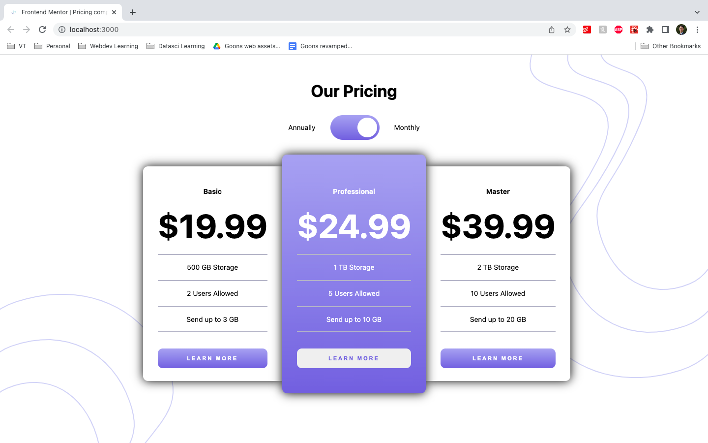

# Frontend Mentor - Pricing component with toggle solution

This is a solution to the [Pricing component with toggle challenge on Frontend Mentor](https://www.frontendmentor.io/challenges/pricing-component-with-toggle-8vPwRMIC). Frontend Mentor challenges help you improve your coding skills by building realistic projects. 

## Table of contents

- [Overview](#overview)
  - [Screenshot](#screenshot)
  - [Links](#links)
- [My process](#my-process)
  - [Built with](#built-with)
  - [Useful resources](#useful-resources)
- [Author](#author)
## Overview
### Screenshot

### Links

- Solution URL: [GitHub](https://your-solution-url.com)
- Live Site URL: [Vercel](https://your-live-site-url.com)

## My process
### Built with

- [React](https://reactjs.org/) - JS library
- [Next.js](https://nextjs.org/) - React framework
- [Framer Motion](https://www.framer.com/docs/) - Animation library

### Useful resources

- [Framer Motion Automatic Switch](https://codesandbox.io/s/framer-motion-automatic-animation-switch-demo-bgun4)
- [How to set the maximum width of a column in CSS Grid Layout?](https://stackoverflow.com/questions/45459151/how-to-set-the-maximum-width-of-a-column-in-css-grid-layout)

## Author

- Website - [GitHub](https://www.your-site.com)
- Frontend Mentor - [@wongd-hub](https://www.frontendmentor.io/profile/wongd-hub)